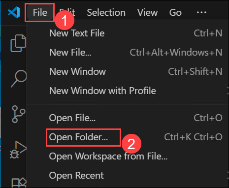

# Exercise 1: Load Balancing and Model Routing 

### Lab Overview

This lab demonstrates how to use Azure API Management (APIM) to load balance requests across multiple Azure AI Foundry model endpoints. You will configure a backend pool with priority and weight-based routing to ensure reliable, scalable AI traffic management. The lab simulates throttling and automatic failover between regional endpoints using APIM’s built-in retry logic.

By the end, you will visualize how APIM intelligently distributes load across AI services for optimal performance and resilience.

## Task 1: Configure load balancing across AOAI resource pools

1. Open Visual Studio Code using the desktop shortcut in the labvm.

2. Click on **File (1)** and select **Open Folder (2)**.

   

3. Navigate to **C:\LabFiles (1)**, select the **AI-Gateway (2)** folder, and click **Select Folder (3)**.

4. If you receive a Do you trust the authors of the files in folder warning, select the **checkbox (1)** and click **Yes, I trust the authors (2)**.

   
