# Exercise 1: Load Balancing and Model Routing 

### Lab Overview

In this exercise, you will learn how to efficiently distribute AI requests across multiple Azure OpenAI (AOAI) backends to ensure high availability and balanced traffic, route requests to the appropriate AI models based on user or application requirements, and implement session affinity to maintain consistent, coherent responses for multi-turn interactions with AI agents. This will give you practical experience in managing scalable, reliable, and context-aware AI deployments.

By the end, you will visualize how APIM intelligently distributes load across AI services for optimal performance and resilience.

## Task 1: Configure load balancing across AOAI resource pools

In this task, you will learn how to distribute incoming AI requests across multiple Azure OpenAI (AOAI) endpoints deployed in different regions. You will configure Azure API Management (APIM) to intelligently route traffic, ensuring high availability, efficient utilization of resources, and seamless failover when one endpoint reaches capacity or becomes unavailable.

1. Open Visual Studio Code using the desktop shortcut in the labvm.

2. Click on **File (1)** and select **Open Folder (2)**.

   

3. Navigate to **C:\LabFiles (1)**, select the **AI-Gateway (2)** folder, and click **Select Folder (3)**.

4. If you receive a Do you trust the authors of the files in folder warning, select the **checkbox (1)** and click **Yes, I trust the authors (2)**.

   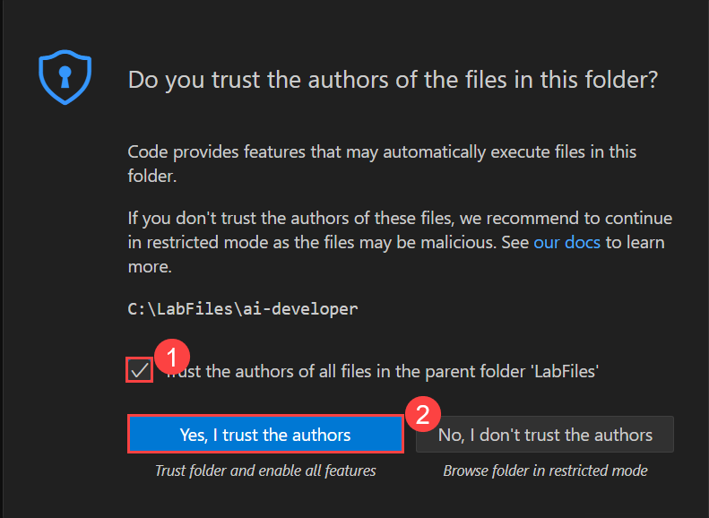

4. From the top menu, click the **… (1)** (ellipsis) button, then select **Terminal → New Terminal (2) (3)**.

    
   
6. Run the Command to Create the Virtual Environment

   ```
   python -m venv venv
   ```

 7. Activate the Virtual Environment:

    ```
    .\venv\Scripts\Activate.ps1
    ```

8. Install Lab Dependencies

   ```
   pip install --upgrade pip

   pip install -r requirements.txt
   ```

   > This installs all Python packages needed for the lab inside the virtual environment, leaving your system Python untouched.

5. In Visual Studio Code, from the left navigation pane, select **Explorer (1)**, then expand the **lab (2)** folder and **backend-pool-load-balancing (3)**, and finally click on **backend-pool-load-balancing.ipynb (4)**.

   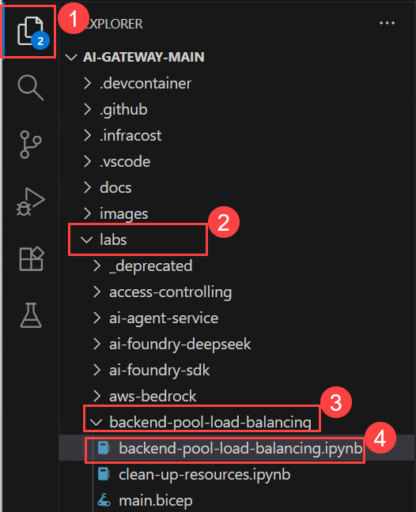

6. Once you’re in the **backend-pool-load-balancing.ipynb** file, take a moment to review each session and read its description. You will see how we deploy multiple AI endpoints, configure API Management for intelligent routing, and test load balancing and failover, giving you a clear understanding of how APIM manages AI traffic across regions.

7. Now, you will run each cell in the notebook one by one, following the instructions and observing the outputs for each step.

8. Scroll down to **0️⃣ Initialize notebook variables**. Click on **Run** in this session, we set up all the necessary variables and configurations, including resource names, regions, AI endpoints, and APIM details. This prepares the notebook for deploying resources and running the lab steps.

   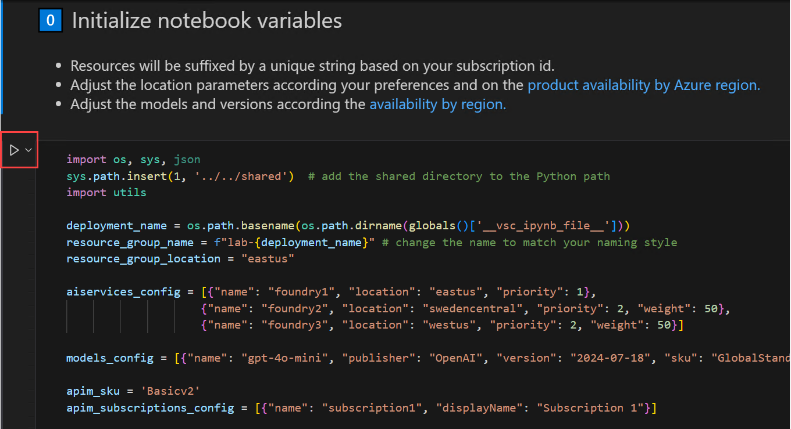

9. Go to **1️⃣ Verify the Azure CLI and the connected Azure subscription**. Click on **Run**, in this session, we check that the Azure CLI is installed, up-to-date, and connected to your subscription. This ensures we can deploy and manage resources in your Azure account. Review the output.

    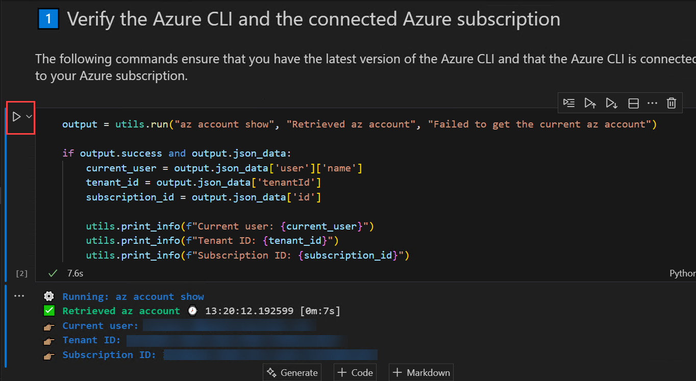

10. In the **2️⃣ Create deployment using 🦾 Bicep**. Here, we use Bicep to define and deploy all necessary Azure resources, including the AI endpoints and APIM service. Running this sets up the infrastructure needed for the lab.

     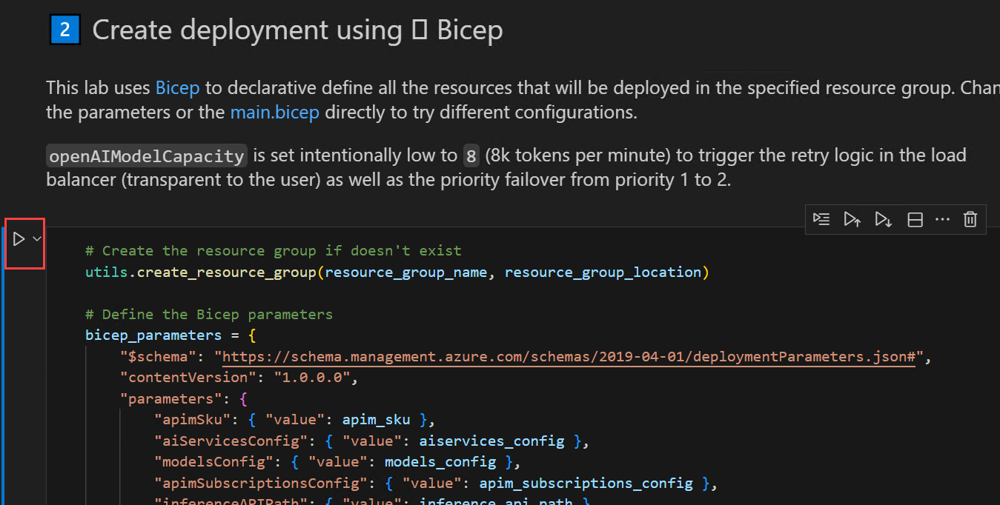

     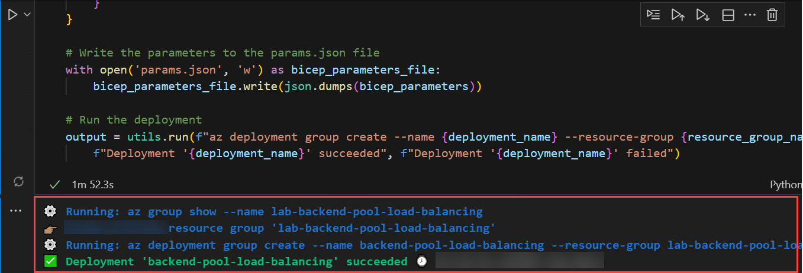
    
12. **3️⃣ Get the deployment outputs**. This session retrieves key information from the deployment, such as API URLs, subscription keys, and resource IDs. We use these outputs to connect and test the AI endpoints in later steps.

    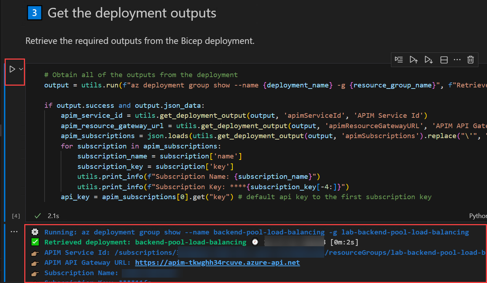
    
14. **🧪 Test the API using the Azure OpenAI Python SDK**. Finally, we test the deployed AI endpoints using the Python SDK to send requests, check responses, and observe which backend region served each request. This demonstrates load balancing and routing in action.

    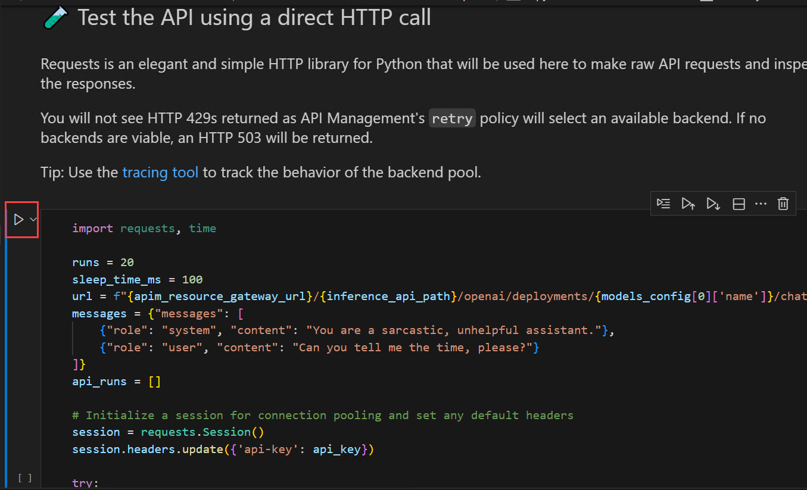

    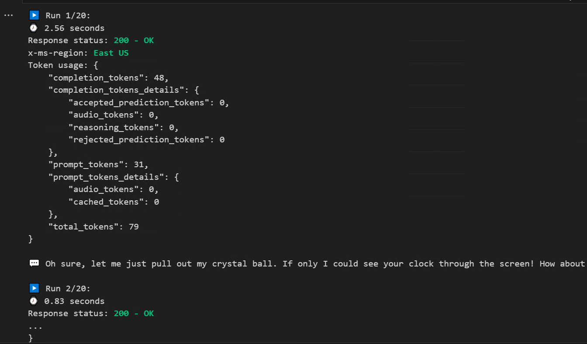

15. **🔍 Analyze Load Balancing results**. In this session, we analyze the load balancing results to see how traffic is distributed across the AI endpoints. The priority 1 backend handles requests first, and once it reaches its limit, traffic is shared between the two priority 2 backends.

      

      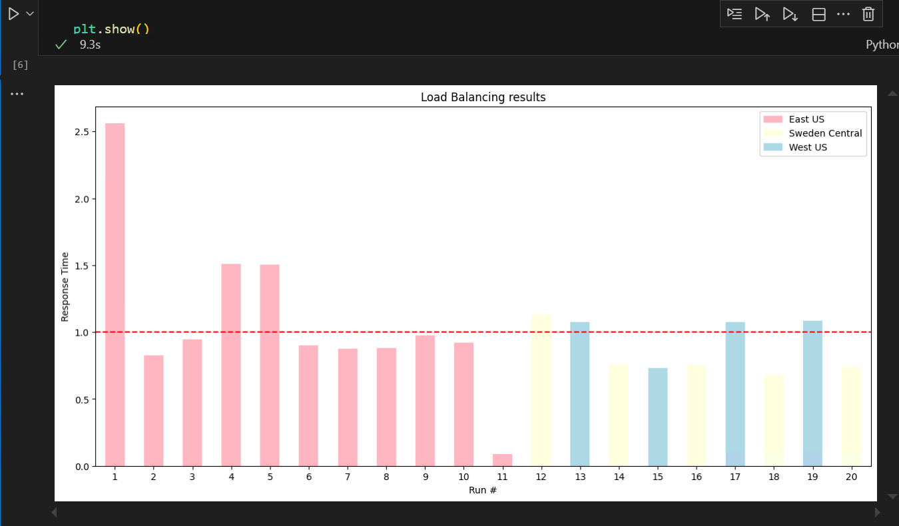

16. **🧪 Test the API using the Azure OpenAI Python SDK**. In this session, we test the deployed AI endpoints using the Azure OpenAI Python SDK. This ensures that the API requests work correctly and responses are received, regardless of which backend region handles them.

    

    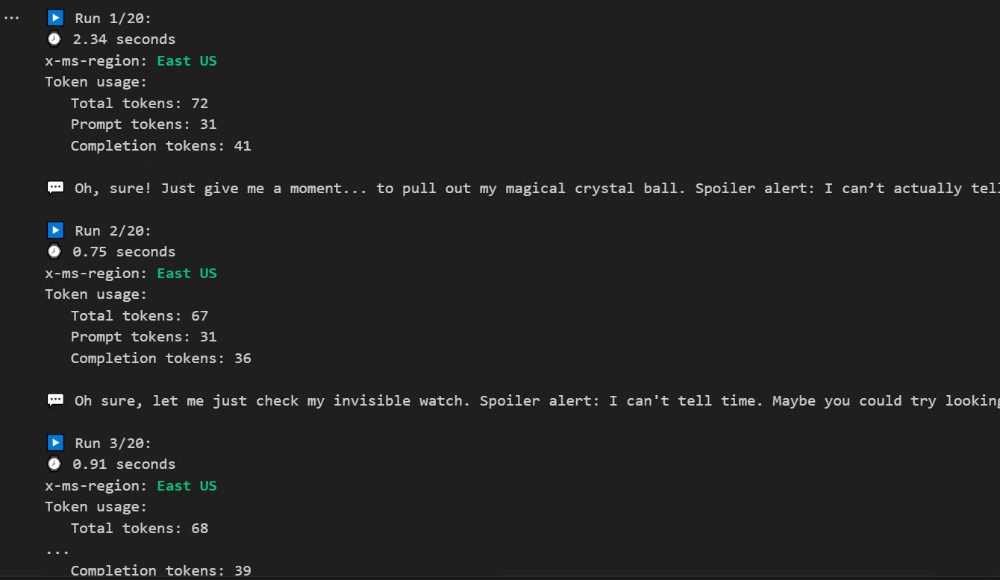
    
## Task 2: Set up model routing for directing requests to different models

This task focuses on directing requests to specific AI models based on parameters such as model type or workload. You will configure APIM to route each request to the correct backend AI model and test the responses, gaining an understanding of how model routing can optimize performance, resource usage, and cost efficiency.

1. In Visual Studio Code, from the left navigation pane, select **Explorer**, then expand **model-routing (1)** click on **model-routing.ipynb (2)**.

   

1. Run the cell **0️⃣ Initialize Notebook Variables**. Sets up all deployment variables, model configs, APIM settings, and inference API info.
At the end, all parameters are ready in memory, no resources are created yet.

   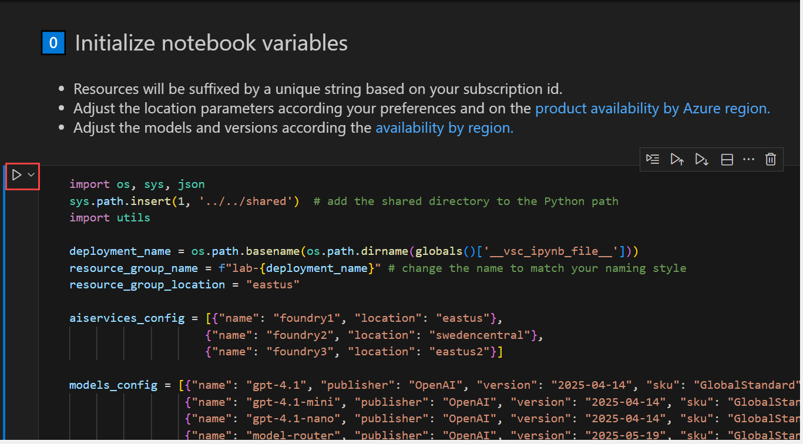

2. Run the cell **1️⃣ Verify Azure CLI and Subscription**. Checks that Azure CLI is connected and retrieves current user, tenant, and subscription info.
At the end, you know the deployment will run in the correct subscription.

   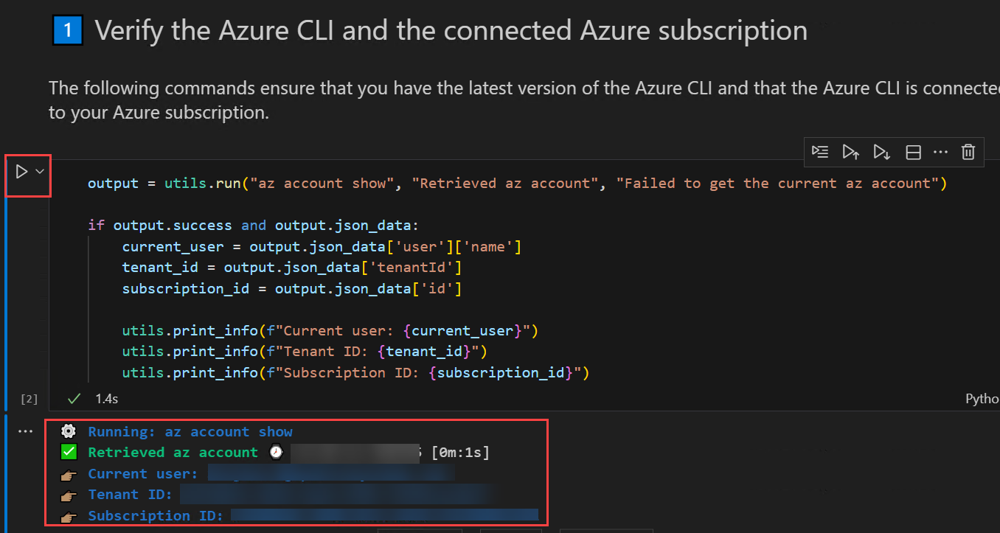
   
4. Run the cell **2️⃣ Create Deployment using Bicep**. Creates the resource group if needed, writes params.json, and deploys resources using Bicep.
At the end, APIM, AI services, and model routing are provisioned (or an error is returned).

   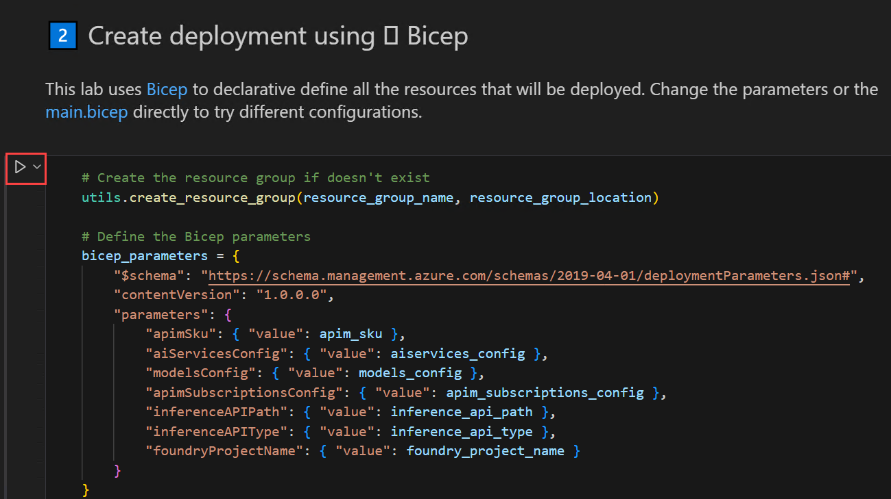
   
6. Run the cell **3️⃣ Get Deployment Outputs**. Fetches outputs like APIM URLs, subscription keys, and workspace IDs from the deployment.
At the end, all resource identifiers and API keys are available for testing the deployed services.

    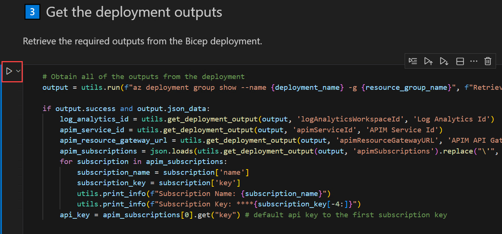
   
8. Run the cell **🧪 Test the API using Azure OpenAI Python SDK**. Connects to APIM and sends messages to multiple models to verify routing and responses.

    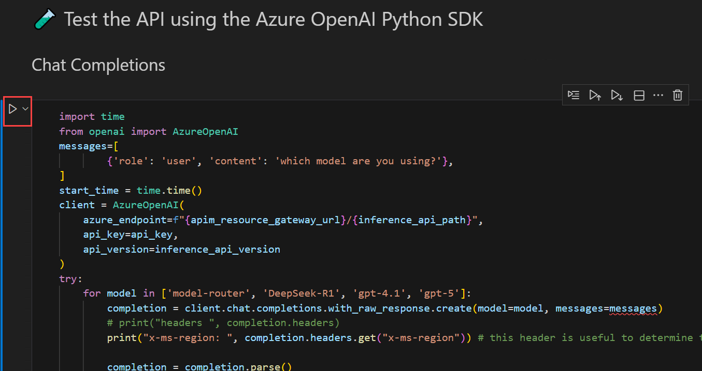

   >**Note**: At the end, model responses and backend regions are printed to confirm deployment and load balancing.

## Task 3: Implement session affinity to keep responses consistent for agent interactions (In Progress)

> Session Affinity, also known as sticky sessions, is a technique used in load-balanced systems to ensure that all requests from a specific user or session are consistently routed to the same backend server or model instance.
