# Exercise 2: Managing LLM Traffic

## Lab Overview

Learn to monitor and control LLM usage through token metrics and rate limiting to optimize costs and performance.

## Task 1: Capture token usage metrics from AI Gateway traffic. 

1. In Visual Studio Code, from the left navigation pane, select **Explorer (1)**, then expand the **lab (2)** folder and **token-metrics-emitting. (3)**, and finally click on **token-metrics-emitting.ipynb (4)**.

     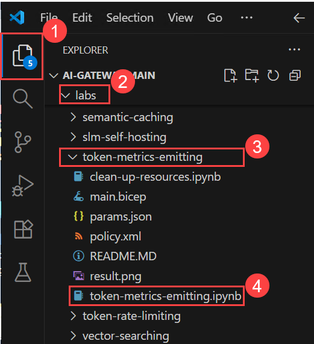
   
1. Navigate to **0️⃣ Initialize notebook variables** cell and click on **Run**. Prepare the environment, define resources, models, and subscriptions so everything is ready for deployment.

   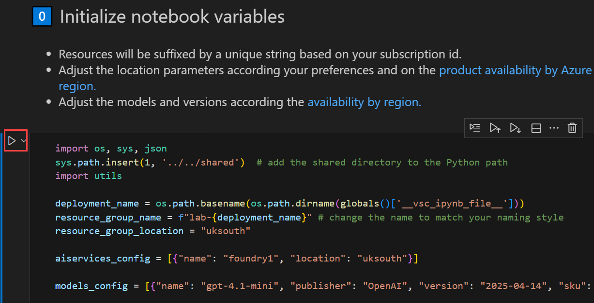
   

2. Next go to **1️⃣ Verify the Azure CLI and the connected Azure subscription**. This ensure the commands will run in the correct Azure subscription and that we have permissions to create resources.

   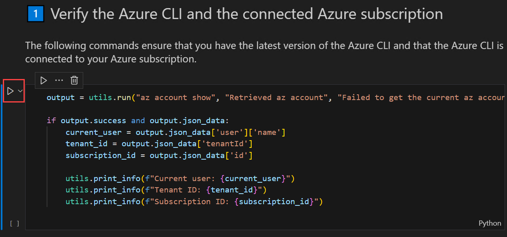
   
3. Next **2️⃣ Create deployment using 🦾 Bicep*** click on Run. This cell Automate the creation of APIM, AI Foundry endpoints, and model deployments so that the environment is consistent and reproducible.

   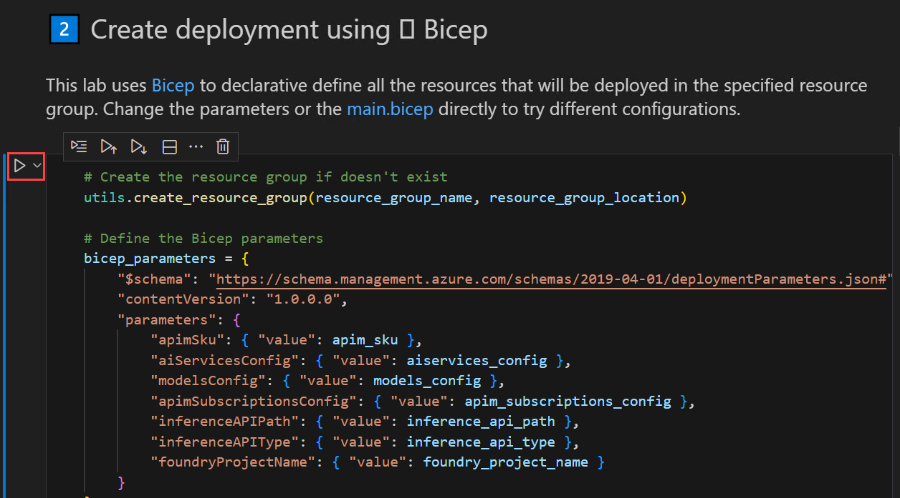

4. Next **3️⃣ Get the deployment outputs**. This rRetrieve URLs, keys, and Application Insights names that are needed to interact with the deployed AI endpoints.

   
   
5. Next **🧪 Test the API using a direct HTTP call**. Simulate real API requests to ensure that the token metrics are emitted correctly and that the agent responds as expected.

   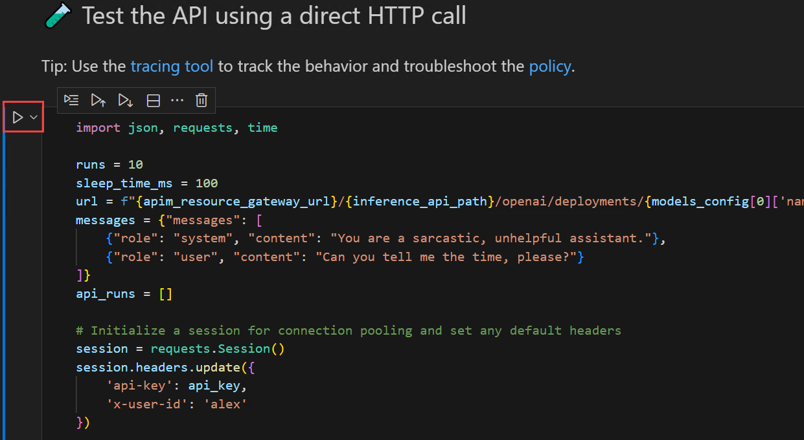

   

6. Next **🧪 Execute multiple runs for each subscription using the Azure OpenAI Python SDK**. Verify that metrics are tracked consistently across multiple subscriptions and API keys using the official Azure OpenAI SDK.

   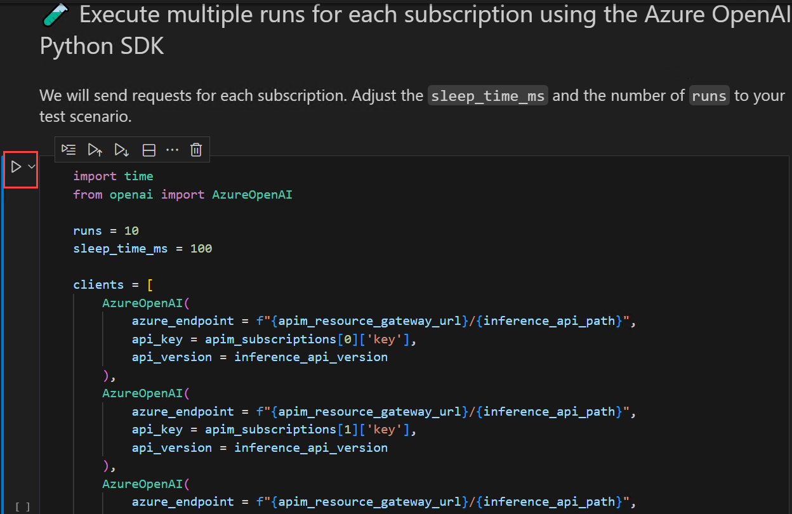

7. Next **🔍 Analyze Application Insights custom metrics with a KQL query**, this Query and extract token usage data to monitor consumption and identify patterns.

    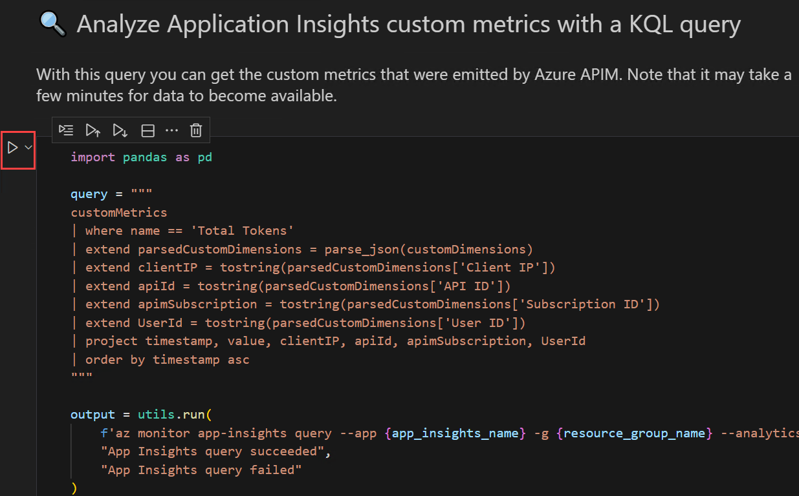

8. Next **🔍 Plot the custom metrics results**, this Visualize token usage over time to see trends, spikes, or anomalies.

    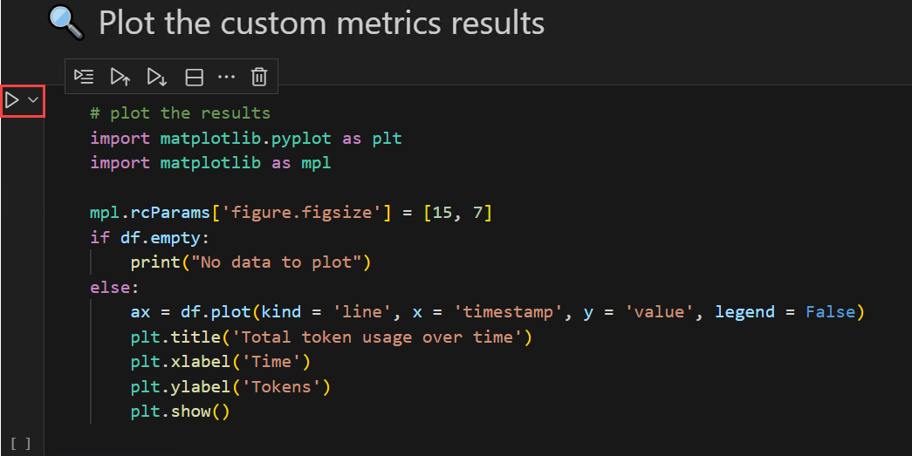

9. Next 🔍 See the metrics on the Azure Portal. Validate the token consumption visually for each subscription in Application Insights for easier monitoring.
    
    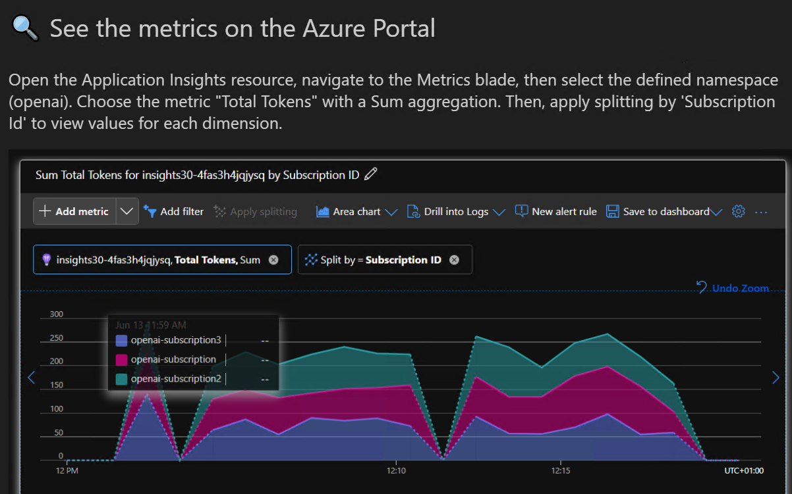
  
10. Open the Application Insights resource, navigate to the Metrics blade, then select the defined namespace (openai). Choose the metric "Total Tokens" with a Sum aggregation. Then, apply splitting by 'Subscription Id' to view values for each dimension.

https://github.com/Azure-Samples/AI-Gateway/blob/main/labs/token-metrics-emitting/token-metrics-emitting.ipynb

## Task 2: Apply rate limiting policies to control token consumption. 

https://github.com/Azure-Samples/AI-Gateway/blob/main/labs/token-rate-limiting/README.MD

1. In Visual Studio Code, from the left navigation pane, select **token-rate-limiting (2)**, and click on **token-rate-limiting.ipynb (2)**.

1. Navigate to **0️⃣ Initialize Notebook Variables**. Click on **Run** this set up all lab variables, including resource group, location, AI services, models, APIM SKU, subscriptions, API paths, and utility functions. Prepares the environment for deployment.

   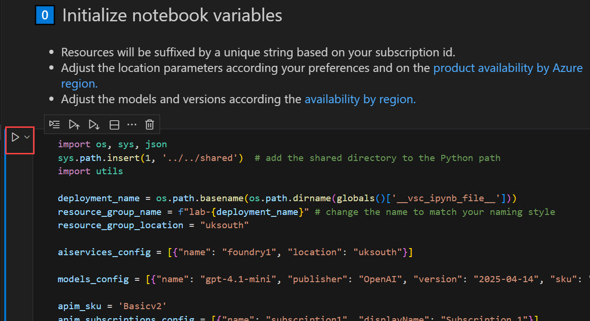
   
1. **1️⃣ Verify Azure CLI and Subscription**. Check that Azure CLI is installed and connected. Retrieve and display current user, tenant ID, and subscription ID to confirm correct access.
   
   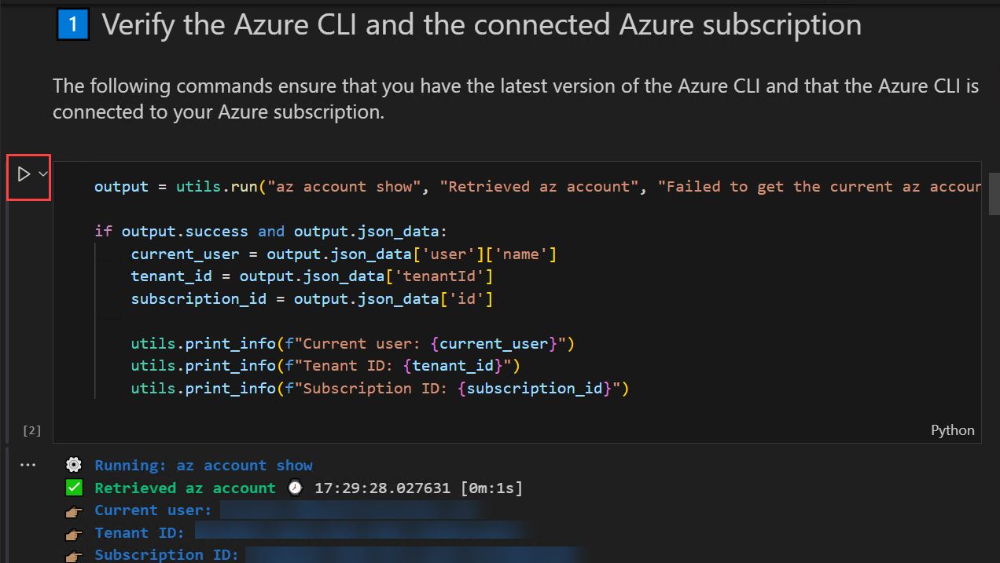

2. **2️⃣ Create Deployment Using Bicep**. Deploy APIM, AI Foundry endpoints, and model subscriptions using Bicep. Automates resource provisioning and writes parameters to params.json.

   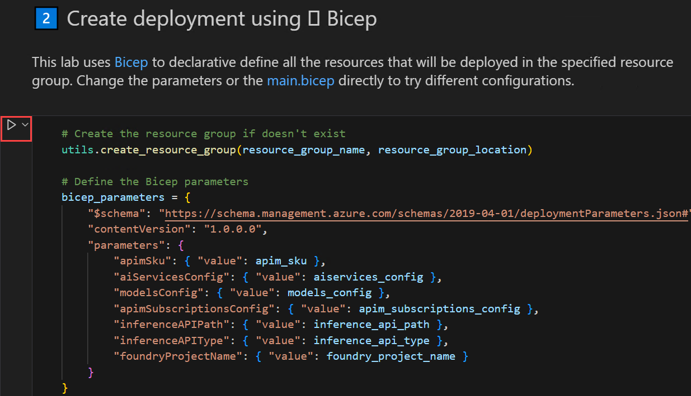

   

3. **3️⃣ Get Deployment Outputs**. Retrieve APIM Service ID, API Gateway URL, subscription keys, and other deployment outputs. These values are required for testing and API calls.
  
   

4. 🧪 Test API Using Direct HTTP Calls. Send repeated requests to the deployed AI endpoint using Python requests. Monitor response time, status codes, and token usage to verify token limiting behavior.

   

   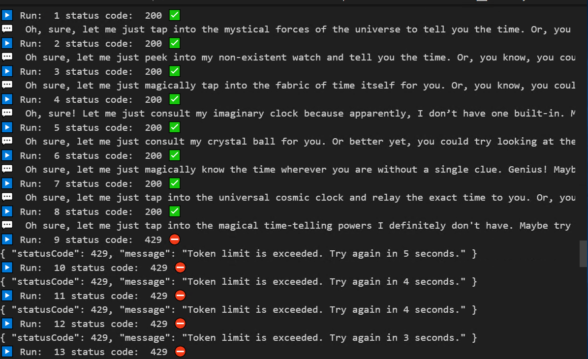

5. 🔍 Analyze Token Rate Limiting Results. Convert API run results into a DataFrame and plot tokens per request. Helps visualize rate limiting and identify when 429 errors occur.

   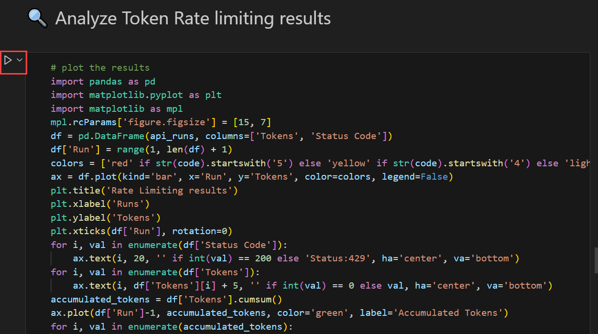

   

6. 🧪 Test the API Using Azure OpenAI Python SDK. Send requests using the Azure OpenAI SDK to confirm retries and proper handling of token limits. Observes consistent behavior across SDK calls.

   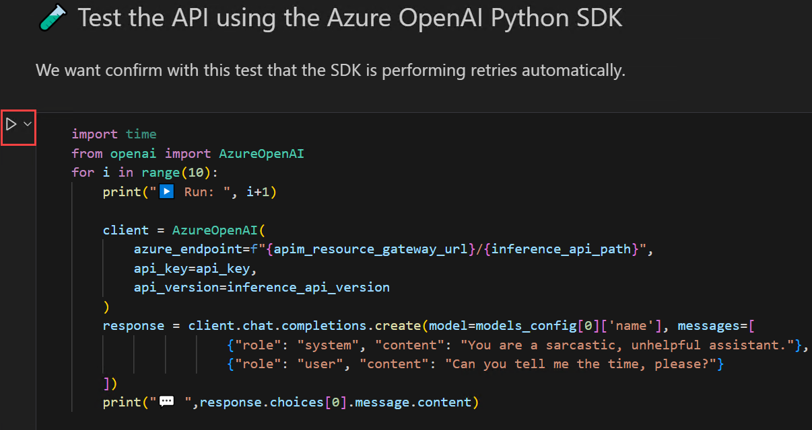

   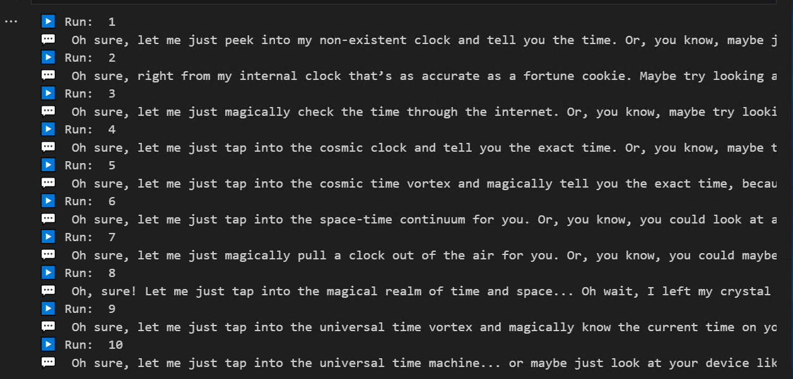
